# Meet WALL·E! An AGV Robot For Logistic Purpose

This project involves the development of a small-scale AGV (Automated Guided Vehicle) robot that could be used in a warehouse or factory. The main motivation behind this project has been to successfully complete the Electronic Equipment Development course at the Public University of Navarre (UPNA).

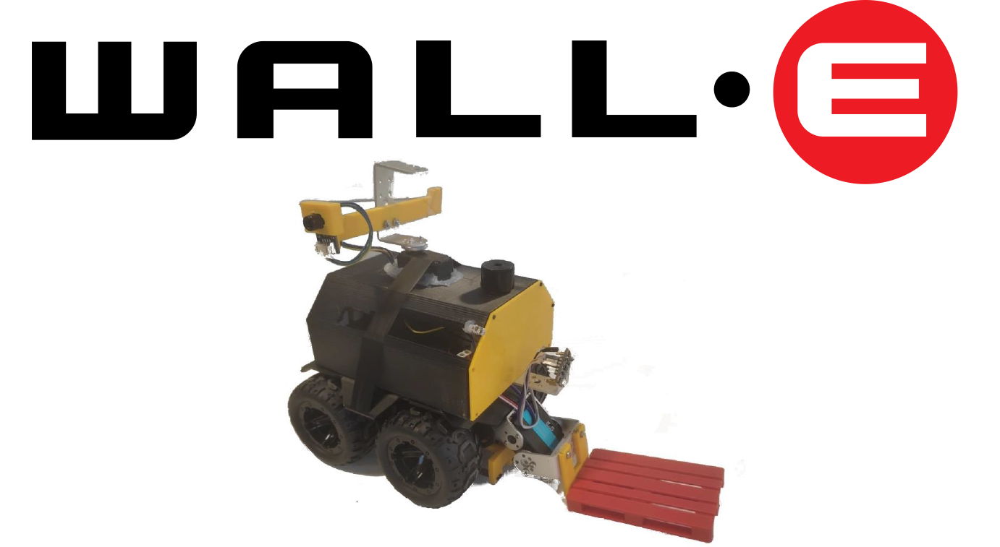

**_Figure 1. Final version of the robot._**

The robot chassis (Figure 2) has been acquired through the company Waveshare because the purpose of the project was electronic learning rather than mechanical. This chassis includes an ESP32 microprocessor, which is connected to the motor drivers and serves as the foundation for programming various sensors and actuators used in the project.

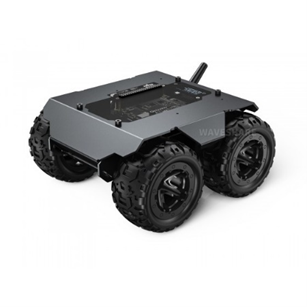

**_Figure 2. Basis chassis. WAVE ROVER from Waveshare._**

The robot must perform the following tasks:

*   Moving through the warehouse.
*   Pick up and deliver pallets.
*   Detect hotspots.
*   Open the IR door and pass through it.
*   Park.

The last challenge is the only one that has not been achieved due to time constraints. Nodes have been defined in the circuit for internal programming, as well as orientation using degrees as the unit (Figure 3).

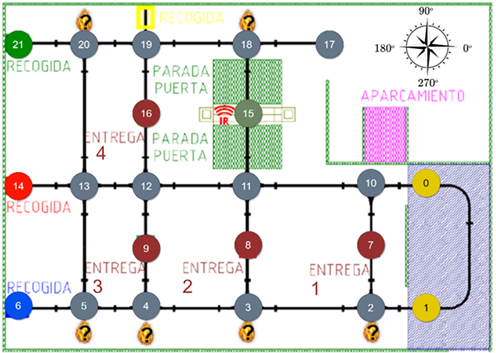

**_Figure 3. Map of the warehouse._**

## HARDWARE

A diagram of the connections made to the ESP32 is provided in Figure 4. The robot's manufacturer has limited the accessible pins; therefore, a multiplexer has been used for the IR sensors, which are used for line following and cross-detection.

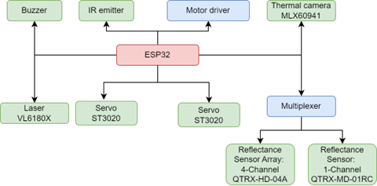

**_Figure 4. Hardware connection diagram._**

## SOFTWARE

The programming has been carried out through the real-time operating system FreeRTOS. This helps in creating tasks that run in a pseudo-parallel manner, allowing better control over the sampling times of sensors and overall system control. These tasks are activated and deactivated through a state machine that enables the sequential operations of the robot, which is shown in Figure 5.

To allow user control of the robot, the ESP32 itself creates a Wi-Fi network through which the user can instruct the robot on the actions it should perform.

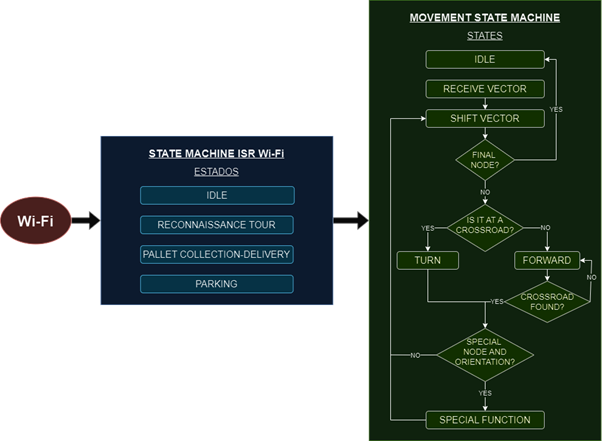

**_Figure 5. Programme flowchart._**

## MOVEMENT

The line-following is accomplished through a PID integrated into the IR sensors, whose layout is shown in Figure 6.

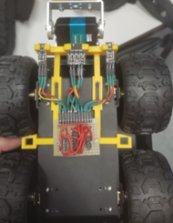

**_Figure 6. IR sensors and multiplexor beneath the robot chassis._**

This movement, along with the Dijkstra algorithm to find the shortest path between nodes and the IR sensors for cross-detection, constitutes the entire movement of the robot. A website has been developed to select from which node to which node it must go.

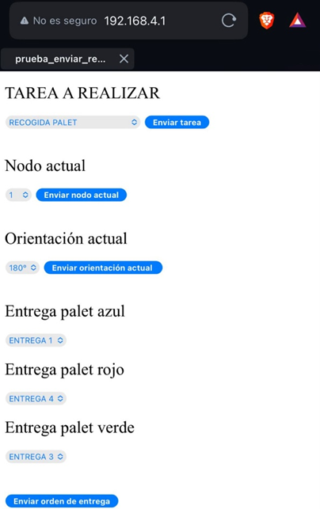

**_Figure 7. Master website._**

## PALLET PICK-UP AND DELIVERY

For pallet delivery and pick-up, a pallet truck is installed in front of the robot which is driven by a servo motor. When nothing is being transported, they are positioned at the top, providing greater safety in case of a frontal collision with an object or individual. During pallet pick-up, the servo positions the paddles in the lowest position. Then, when the pallet is transported, the paddles are lifted as little as possible so as not to touch the floor or tip the pallet over. The process is pictured in Figure 8.

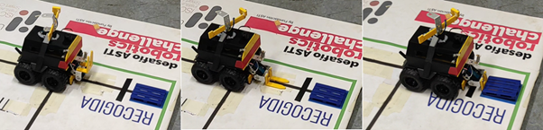

**_Figure 8. Process of picking up the pallet._**

The pallet delivery follows a similar process but in reverse. Going with the paddles slightly raised, the pallet arrives at the delivery point. At this point, the shovels are lowered to deposit the pallet. Then, the paddle is raised to the safety position.

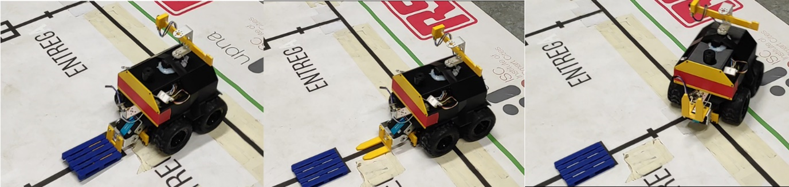

**_Figure 9. Process of delivering the pallet._**

## HOTSPOTS DETECTION

For the detection of hot spots, a thermographic camera is used, with a 360º range of vision provided by a servo motor positioned above the robot. When it detects a hot spot, it activates a buzzer to alert about it. In the absence of outputs capable of acting with a PWM on the buzzer, an oscillator circuit has been designed to excite the buzzer, which is activated by a simple digital output.

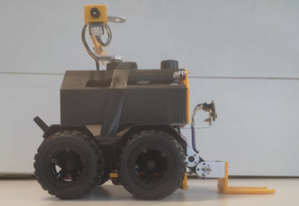

**_Figure 10. Termographic camera setup on the robot._**

## IR DOOR OPENING

An IR emitter is placed on the robot's front-right side, so it can send a NEC code to an IR receiver, which opens a barrier that blocks the pass through the door. The state of the door is also displayed with a semaphore, which is red when the door is closed and green when the barrier is lifted.

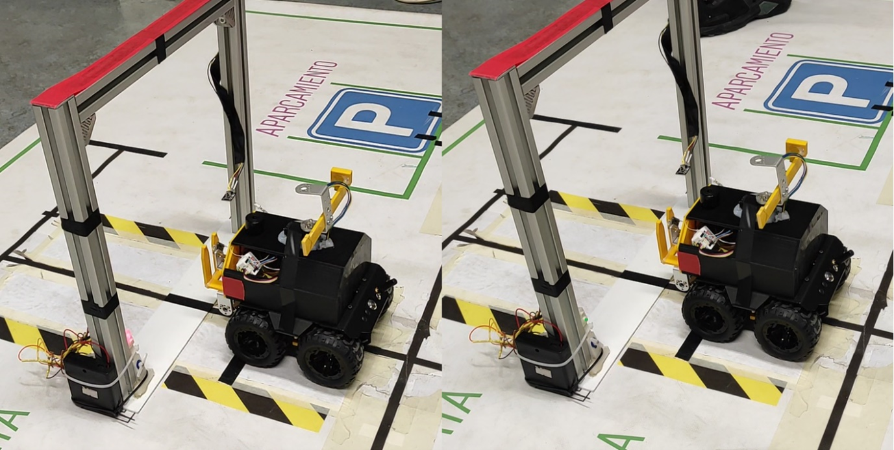

**_Figure 11. Opening the IR door._**

## CONCLUSIONS

Considering all that has been seen, it can be said that a complete electronic project has been developed, defining the needs, proposing technical solutions and combining different sensors, actuators, auxiliary circuits, devices and firmware to be able to carry out the project. It is considered that a potentially scalable product for the industry has been developed.

Below is the video showing the operation of the robot.

[YouTube Demo](https://youtu.be/STE1HxnR2Vo?si=1gU94ZB5VibyTt0Y)

#### _Authors: [Asier Legaz](https://www.linkedin.com/in/asier-legaz-catena/), [Vadim Coselev](https://www.linkedin.com/in/vadimcoselev) and [Marcos Álvarez](https://www.linkedin.com/in/marcos-%C3%A1lvarez-echarri/)._